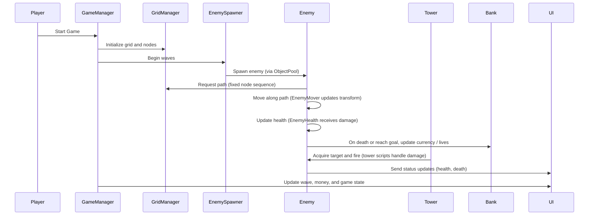

# Realm Rush — Fixed Path

This repository contains a Unity project that implements a fixed-path tower defense game inspired by "Realm Rush." The project includes game scenes, assets, and C# scripts for pathfinding, enemy behavior, towers, UI, and basic game systems.

**Purpose:** Provide a small, self-contained Unity project implementing fixed-path enemy movement, tower targeting, and simple economy mechanics for learning, prototyping, or educational use.

**Contents:**
- **Assets/**: Unity assets, prefabs, and scripts used by the game.
	- **Assets/Enemy/**: Enemy prefabs and scripts (`Enemy.cs`, `EnemyMover.cs`, `EnemyHealth.cs`, `ObjectPool.cs`).
	- **Assets/Pathfinding/**: Grid and node implementation (`GridManager.cs`, `Node.cs`).
	- **Assets/Tiles/**: Road and environment tile prefabs used to build levels.
	- **Assets/Bank/**: Currency/economy logic (`Bank.cs`).
	- **Assets/UI/**: UI prefabs and scripts.
- **ProjectSettings/**: Unity project settings and version (see `ProjectVersion.txt`).
- **Packages/**: Unity package manifest and dependencies.

**Key files**
- `Realm Rush Fixed Path/Assets/Pathfinding/GridManager.cs` — grid/node management and initialization.
- `Realm Rush Fixed Path/Assets/Enemy/EnemyMover.cs` — enemy movement along nodes.
- `Realm Rush Fixed Path/Assets/Enemy/EnemyHealth.cs` — health and death handling.
- `Realm Rush Fixed Path/Assets/Enemy/ObjectPool.cs` — pooling for enemies and other objects.
- `Realm Rush Fixed Path/Assets/Bank/Bank.cs` — currency and rewards management.

**Technologies & Tools**
- **Unity**: Editor version recorded in this project: 2020.3.16f1 (LTS).
- **C#**: Game logic and scripts.
- **Unity Editor**: Scenes, prefabs, and assets created with the Unity Editor.
- **TextMesh Pro** and other Unity packages available in `Assets/AssetPacks` and `Packages/manifest.json`.

**How the application flows**

Below is a high-level sequence diagram showing the main runtime interactions between systems.

**Notes & Next steps**
- This project is intended for learning and modification. You can open the Unity project in Unity 2020.3.16f1 to inspect scenes and play the game.
- To extend the project: add tower types, varied enemy behaviors, path branching, wave editor UI, or build export settings.
